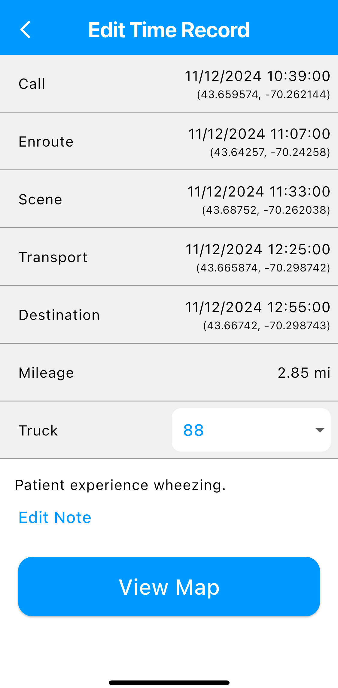
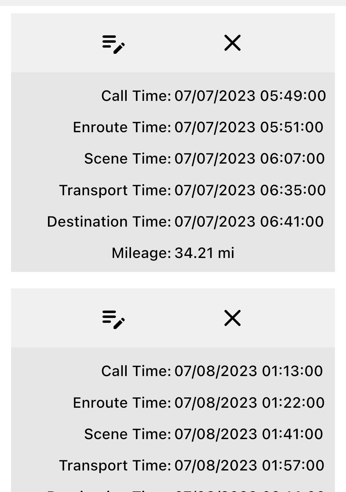

# History Window

The history window will display all of the saved record.

## Overall Action Buttons

The action buttons are located on the top of history screen.

- Filter Records Date
  

  > Opens date selection for filtering rescue times call time.

- Filter Records by Notes
  

  > Tap on search icon will display a text box with another same icon to the left of text box. Fill in text box with text to filter through notes with. Either hit search on keyboard or search icon to the left of text box to filter notes. The filter will include the date filter.

- Sync Cloud Data
  

  > Only for premium Response Time Trackers. Sync rescue times with cloud storage of times.

- Download csv
  

  > Downloads a csv file in external storage on the user's phone.

- Delete all
  

  > Deletes all records saved on the phone. There is no way to get records back after deleting.

- Layout Change
  

  > Toggles the time record history layout from either block grid style or spreadsheet grid style.

## Edit Indiviual Record

The edit window allows for the time record to be edited.
Tap on the list item to edit the specific item in the time record.
For times, a date option will be displayed for change, then a time option will be displayed for change.
When pressing `OK`, the data/time will save the changes. When pressing `CANCEL`, the data/time will not be changed.
For mileage, a decimal keyboard and a white popup box will display for change.
When pressing `Change`, the mileage will save the change of the entered decimal number in the white box.
If the number is blank, then the mileage won't change.
When pressing `Cancel`, the mileage will not change the mileage saved.
When a an item is edited, the bottom notification will display the save status.
After the time record has been finished being edited, press the back arrow on the top left of the screen to leave the edit window.

- `Call` _Date/Time_
- `Enroute` _Date/Time_
- `Scene` _Date/Time_
- `Transport` _Date/Time_
- `Destination` _Date/Time_
- `Mileage` _Decimal_
- `Notes` _Text_
- `Truck` _Truck_

### Truck

The truck will be the truck used during that rescue.
The truck selection is setup in the settings window.

### Location

For those who have premium subscription can utilize the location feature attached to a time rescue.

#### Location position

Location of latitude and longitude of a time record will be attached.

##### Location View

Depending on the edit card view layout, there will be coordinate pair of separate latitude/longitude values within the same card of a specific time.

###### Location Map

There is a view map button on the button of editing a rescue that will display a Google map of time rescue.
Each time that has a location position will 

##### Location Edit

When editing a datetime of a record, the editing of latitude and longitude will display after setting datetime.
Hit complete to save changes of latitude/longitude value.
Hit cancel to not save changes of latitude/longitude value.

## Layouts

### History card layouts

#### Block Grid Layout

The block grid layout displays each time record with the times in a block.
There is the delete button and the edit button on the top corners of the time record block.

##### Indiviual Record Buttons

There are two icons on each corner of each time record that is pressable.

- Edit
  

  > Allows for the record to be edited. An edit window will display to edit the record.

- Delete
  
  > Deletes the one record selected. Once deleted, there is no way to get the record back.
  > A confirmation prompt will display before deleting the record.

#### Spreadsheet Grid Layout

The spreadsheet grid layout compacts the time records to make it easier to see all the times.
Tap on the horizontal list of times to edit the times on that record.

### Edit Card

#### Simple Card

The simple card layout will display time rescue name on the left and the datetime on the right.
If paid for premium subscript, the location position coordinate will display under the datetime.

#### Informative Card

The informative card layout will display time rescue name on the time.
All of the date will be displayed below with name of data on the left and value of the data on the right.