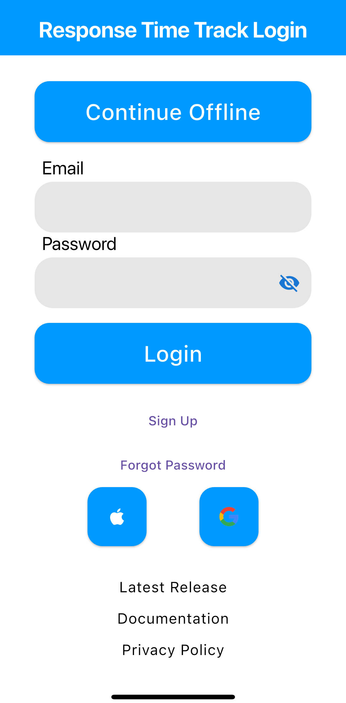

# Login Screen

The login screen allows for login through Google or Apple.
There is also guest mode for those who do not want a login.
Lastly, the bottom provides links about the app.

** The login page will be skipped if previously login **

### Continue offline

Continue as guest for Response Time Track. Preferred if want to stay private and keep data on phone.

### Login with Apple

Login with Apple for Response Time Track.
Apple may ask if you'd like your email shared, which is optional.
If not paid for subscription, there is no cloud storage.

### Login with Google

Login with Google for Response Time Track.
If not paid for subscription, there is no cloud storage.

### Login with Email

Login with your email for Response Time Track.
If not paid for subscription, there is no cloud storage.

#### Forgot Password

Forgot password is for those who forgot password, which an email will be sent for forgot password.

#### Sign up

Sign up is required for email address login.
Only email and password is needed.
After doing email registration, the account must be verified in email to confirm the email is legit.

### Links

Below links are for release notes, documentation, and privacy policy
