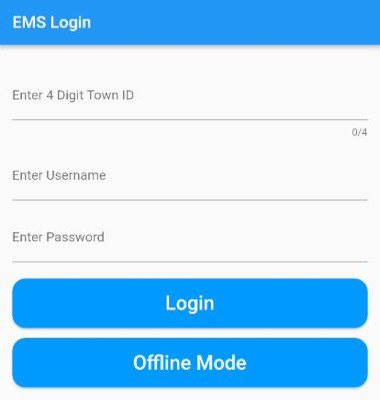
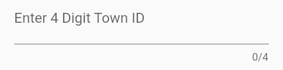
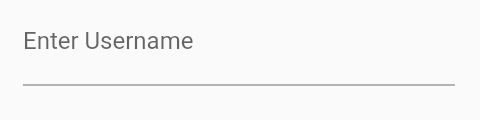
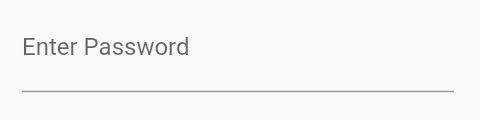

# Login Screen

First screen to be seen by the user. This screen allows the user to login or continue on in offline mode.

## Login

Enter the 4 digit town number, username, and password.
Once information has been entered, press the `Login` button to gain access to the app with user's credentials.

#### Enter 4 Digit Town ID

The 4 digit town ID is the 4 digit identification number assigned by the State. This ID is used to link the records to the town.

#### Enter Username

The username of paramedic's account. This is to identify the paramedic.

#### Enter Password

The password of paramedic's account. This is the authienticate that it is the right paramedic.

## Offline Mode

Offline mode is for users who can't access the internet.
Also, towns who don't pay for server space and accounts will not be able to use the regular login.
Users can do everything in the offline version except for send data to the server.
