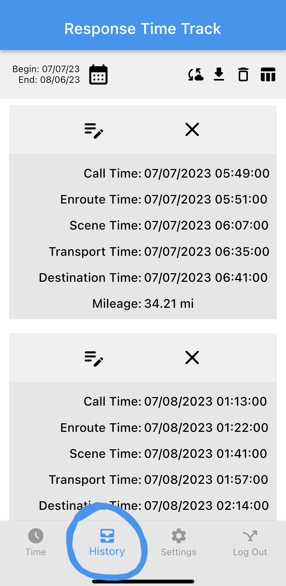

# History Window

The history window will display all of the saved record.

### Overall Action Buttons

When clicking on the bottom right blue button with the hamburger logo will display three action Buttons.
Each action from the bottom right blue menu buttons will ask for a confirmation.
After confirmation and completing action, a notification on the bottom will display what has happened for the action.

- Hamburger
  

  > Toggles display of the other action buttons.

- Download csv
  

  > Downloads a csv file in external storage on the user's phone.

- Send to server
  

  > Sends all of the record information to the server. If in `Offline Mode`, the prompt will ask to logout then login.

- Delete all
  

  > Deletes all records saved on the phone. There is no way to get records back after deleting.

### Indiviual Record Buttons

There are two icons on each corner of each time record that is pressable.

- Edit
  

  > Allows for the record to be edited. An edit window will display to edit the record.

- Delete
  
  > Deletes the one record selected. Once deleted, there is no way to get the record back.
  > A confirmation prompt will display before deleting the record.

### Edit Indiviual Record

The edit window allows for the time record to be edited.
Tap on the list item to edit the specific item in the time record.
For times, a date option will be displayed for change, then a time option will be displayed for change.
When pressing `OK`, the data/time will save the changes. When pressing `CANCEL`, the data/time will not be changed.
For mileage, a decimal keyboard and a white popup box will display for change.
When pressing `Change`, the mileage will save the change of the entered decimal number in the white box.
If the number is blank, then the mileage won't change.
When pressing `Cancel`, the mileage will not change the mileage saved.
When a an item is edited, the bottom notification will display the save status.
After the time record has been finished being edited, press the back arrow on the top left of the screen to leave the edit window.

- `Call` _Date/Time_
- `Enroute` _Date/Time_
- `Scene` _Date/Time_
- `Transport` _Date/Time_
- `Destination` _Date/Time_
- `Mileage` _Decimal_
