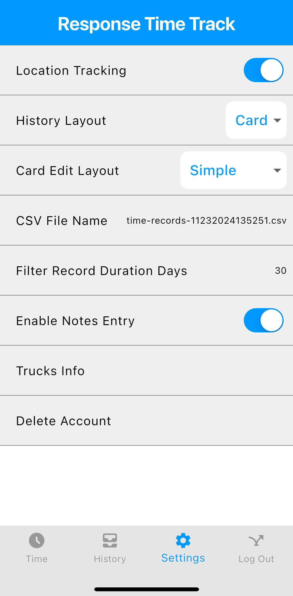

# Settings

Setting window allows for you to change specific setup and default values of Response Time Track.

## Setting Items

### Location Tracking

Location tracking is used to calculate the mileage traveled during a rescue time.
This feature only displays for premium Response Time Trackers.

### History Information Layout

History information layout determines the layout on first load into history window. The options are `card` and `grid`.

### CSV File Name

When exporting csv file, the default name of CSV will have whatever text in settings added with the current date and time.

### Filter Record Duration displays

Filter record duration displays is the default amount of days from today to filter rescue times in the history window.

### Purchase subscription

For those who are not a premium Response Time Tracker, there is a place to purchase a subscription for no ads, cloud storage, and location tracking.

### Enable Notes Entry

Enable notes entry will display a text box to add a note to rescue time at the end of tracking rescue time in time window.

### Delete Account

Delete account will only display for those who are login. Delete account will delete account.
