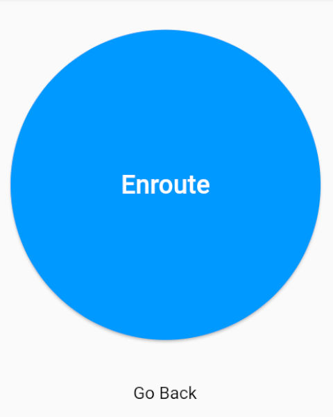
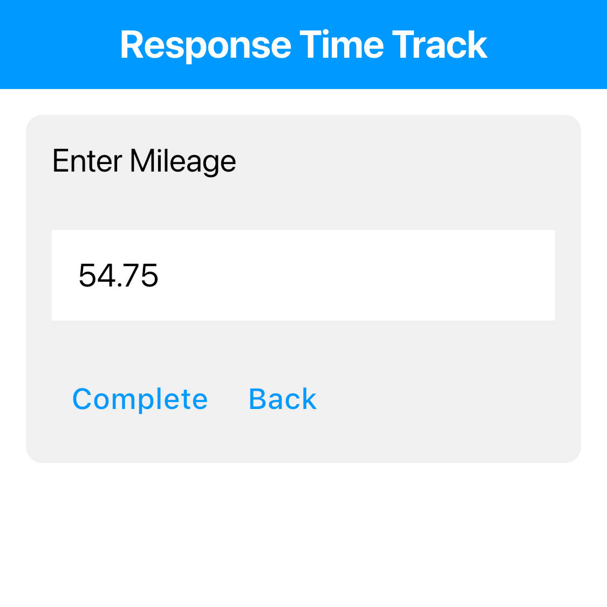

# Time Window

The time window is the tool that collects the time at which an action has happened.
At the end, the time window will ask for user to enter mileage traveled.

## Actions

Each action will have a button in the middle of the screen to push when switching to a different actions.
Below the button is a `Go Back` text that is clickable.
When clicked on, the action will go backwards and will override previous time when clicking on the button to go forward.

- `Call Received`

  > Push when the call has been retrieved.

- `Enroute`

  > Push after call ended and starting the drive to the scene.

- `Scene`

  > Push after arriving onto the scene.

- `Transport`

  > Push when leaving the scene.

- `Destination`

  > Push after arriving to destination.

## Mileage

At the end of the actions is a place to enter the mileage traveled during the rescue.
Click on the white box in the middle of the pop up box to display the keyboard.
Enter the mileage in the white box. After typing out the mileage, hit `Complete` to save the time record.
If nothing was typed in the box, the mileage will be saved as 0 miles.
If `Destination` button was accidently clicked, there is a `Back` text in the mileage display box to go backwards.
Lastly, when the record has been completed, there will be the save status of the record pop up notification on the bottom of the screen.

